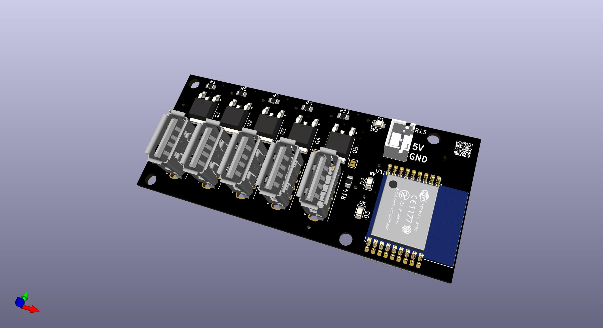
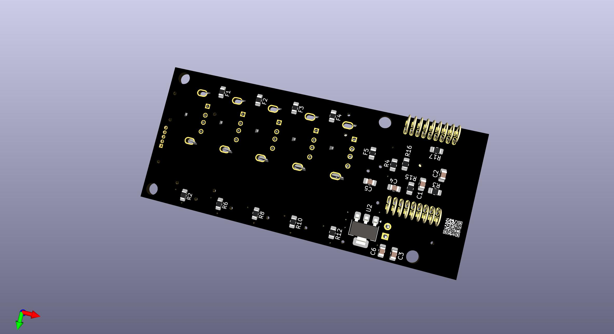

# USBPowerBlock
Tasmota controlled USB Switching

# Why?

So many things are usb powered but can not or are not able to be integrated easily within Home Assistant; or programable.

Want to turn something on or off automatically? you will need to buy [something else](https://www.aliexpress.com/w/wholesale-TZT-sinilink-USB.html?spm=a2g0o.productlist.search.0)! and it still needs a power source

Want it to be integrated into [Home Assistant](https://www.home-assistant.io/) and or control its [privacy](https://www.voanews.com/a/east-asia-pacific_voa-news-china_cybersecurity-experts-worried-chinese-firms-control-smart-devices/6209815.html)? good luck off the shelf, you may need to [flash it](https://templates.blakadder.com/sinilink_XY-WFUSB.html) (if its supported)

Want more than one device powered from a single power source, you will need a powered hub and multiple other devices, or multiple power sources, this effectively combines 5 [sinilinks'](https://www.aliexpress.com/w/wholesale-TZT-sinilink-USB.html?spm=a2g0o.productlist.search.0) into a single unit.

It has been designed to power a device up to 500mA with the listed BOM, but is flexible (see Options below)

500mA was chosen as a default, as a 5v 2.5A/3A powesupply is very common and affordable (you probably already have one!) and this was intended to switch very low current devices (think, lights, IoT devices, etc)

For more information on USB power draw:

https://en.wikipedia.org/wiki/USB_hardware#Allowable_current_draw

Note, this does not identify itself as a PD or Battery Charging (BC) Device! (yet), technically each port should be limited to 100mA in its current design, but taking some liberties here!

# BOM

[Bill Of Materials](./USBPowerBlock_BOM.csv)

|Reference            |Value                    |Datasheet                                                                                                              |Qty                                                      |Product_Link|
|---------------------|-------------------------|-----------------------------------------------------------------------------------------------------------------------|---------------------------------------------------------|------------|
|C1,C3,C4,C6          |0.1UF-0805-25V-_+80_-20%_|https://www.lcsc.com/datasheet/lcsc_datasheet_2304140030_TORCH-CT41G-0805-2X1-50V-0-1-F-K-N_C126469.pdf                |4                                                        |https://www.lcsc.com/product-detail/C126469.html|
|C2,C5                |10UF-0805-16V-10%        |https://www.lcsc.com/datasheet/lcsc_datasheet_2409292003_Vishay-Intertech-VJ0805G106KXYTW1BC_C5334346.pdf              |2                                                        |https://www.lcsc.com/product-detail/C5334346.html|
|D1 |Blue |https://wmsc.lcsc.com/wmsc/upload/file/pdf/v2/lcsc/2208221800_TCWIN-TC0805GF01-1CSA_C5137315.pdf|1  |https://lcsc.com/product-detail/C5137315.html|
|D2 |Green|https://wmsc.lcsc.com/wmsc/upload/file/pdf/v2/lcsc/2410121920_Lite-On-LTST-C170KGKT_C98221.pdf  |1  |https://lcsc.com/product-detail/C5137315.html|
|D3 |Red  |https://wmsc.lcsc.com/wmsc/upload/file/pdf/v2/lcsc/2504101957_XINGLIGHT-XL-2012SURC_C965812.pdf |1  |https://lcsc.com/product-detail/C5137315.html|
|F1,F2,F3,F4,F5       |JK-SMD0805-020-30V       |https://www.lcsc.com/datasheet/lcsc_datasheet_2007081813_Jinrui-Electronic-Materials-Co--JK-SMD0805-020-30V_C516070.pdf|5                                                        |https://www.lcsc.com/product-detail/C516070.html|
|J1,J2,J3,J4,J5       |USB_A                    | Vertical USB-A                                                                                                                      |5                                                        |https://www.aliexpress.com/item/1005005865561469.html or https://www.lcsc.com/product-detail/C456015.html|
|J6 |IO   |~                                         |1  |~                                                    |
|J7                   |Power_In                 | XH2.5                                                                                                                      |1                                                        |https://www.aliexpress.com/item/1005003137518807.html|
|Q1,Q2,Q3,Q4,Q5       |LMAK15N10                |https://www.lcsc.com/datasheet/lcsc_datasheet_2504180925_VBsemi-Elec-ME15N10-VB_C710010.pdf                            |5                                                        |https://www.lcsc.com/product-detail/C710010.html|
|R1,R3,R4,R5,R7,R9,R11,R15,R16|10KOHM-0805-1_10W-1%     |https://www.lcsc.com/datasheet/lcsc_datasheet_2410121912_TyoHM-RMC080510K5-N_C269724.pdf                               |9                                                        |https://www.lcsc.com/product-detail/C269724.html|
|R2,R6,R8,R10,R12     |100R                     |https://www.lcsc.com/datasheet/lcsc_datasheet_2411221126_UNI-ROYAL-Uniroyal-Elec-0805W8F1000T5E_C17408.pdf             |5                                                        |https://www.lcsc.com/product-detail/C17408.html|
|R13,R17|68OHM-0805-1_10W-1%|https://www.lcsc.com/datasheet/lcsc_datasheet_2410121912_TyoHM-RMC080510K5-N_C269724.pdf|2  |https://www.lcsc.com/product-detail/C269724.html|
|R14    |470OHM-0805-1_10W-1%|https://www.lcsc.com/datasheet/lcsc_datasheet_2410121912_TyoHM-RMC080510K5-N_C269724.pdf|1  |https://www.lcsc.com/product-detail/C269724.html|
|U1                   |ESP-WROOM-02             |https://www.espressif.com/sites/default/files/documentation/0c-esp-wroom-02_datasheet_en.pdf                           |1                                                        |https://www.lcsc.com/product-detail/C529584.html|
|U2                   |AMS1117-3.3              |http://www.advanced-monolithic.com/pdf/ds1117.pdf                                                                      |1                                                        |https://www.lcsc.com/product-detail/C2992570.html|

Misc Components:

| Product | Example Link | Qty |
| ------- | -------------| --- |
| 5V 2.5A (min) Power Supply | https://www.wagneronline.com.au/5-volt-3a-switch-mode/power-supplies/power-lighting/smp5v-3a-21r-35234/10297/pd/ | 1 |
| Power Socket 5.5x2.1mm| https://www.aliexpress.com/item/1005002601060281.html | 1 |
| Hook Up Wire ~24AWG | https://www.aliexpress.com/item/1005007278251470.html | 1x Length Red   1x Length Black |
| PCB | [Here](./USBPowerBlock/gerber) | 1 |
| Case | [Here](./Case) | 1 |
| Flexy Pins | https://core-electronics.com.au/flexypin-pack-of-100.html | 18 |

# Options

## I want more current! 

- Swap out your power adaptor for something that can supply your desired current along with approx (at least) ~250mA for the ESP
- Replace F1-F5 with a suitable current rating; 0805 package self healing fuse

  - https://www.lcsc.com/product-detail/C516070.html 500mA
  - https://www.lcsc.com/product-detail/C369151.html 1.5A
  - https://www.lcsc.com/product-detail/C2830234.html 2.2A
  
The MOSFETS are rated to approx 15A each, which is overkill.

## I don't need switched outputs but want like 5 powered USB ports

- leave all components out except J1-J5 + J7
- leave F1-F5 in (and up-rate the fuse value, see above) or replace with 0805 0 Ohm links (https://www.lcsc.com/product-detail/C96345.html)
- solder JP1-JP5
- ensure your power adaptor has enough current

# PCB

Gerber files are available to have printed

- https://www.pcbway.com/
- https://jlcpcb.com/

# 3D Printed Case

STL's are available in this repo to print or have printed

- https://www.pcbway.com/rapid-prototyping/manufacture/?type=2
- https://jlc3dp.com/?source=JLCPCB-top-productbar

# Assembly

TBC

# Tasmota

TBC

# What Next?

Some notes on desired features! (maybe, but probably not)

- Power from a 12V supply?
- Increased power outputs and PD/BC support?
- Compliant USB-C PD Power Source 
- Completed photos
- Flexypin-less design?
- ESP32-C3-WROOM design (ESP-WROOM-02 is EOL) with and without FlexyPin